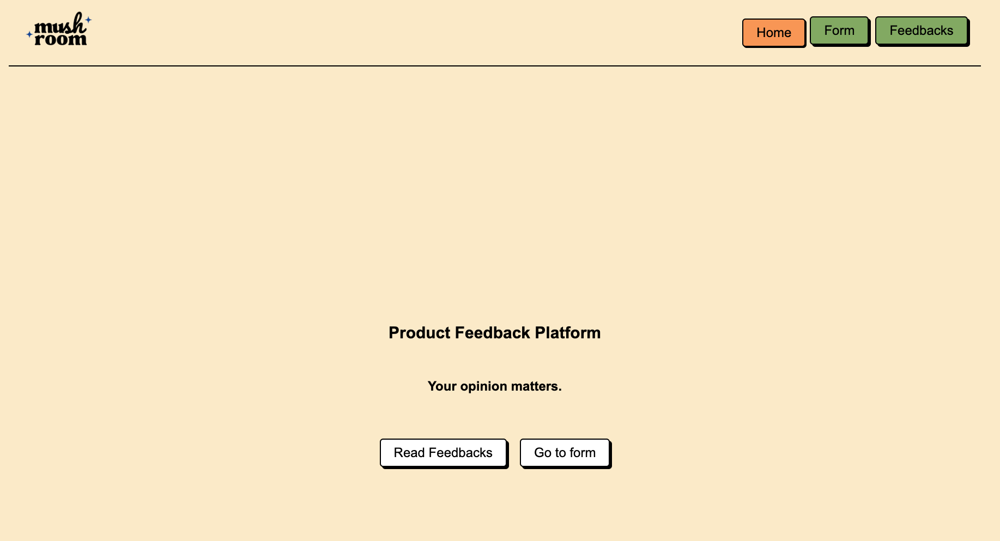
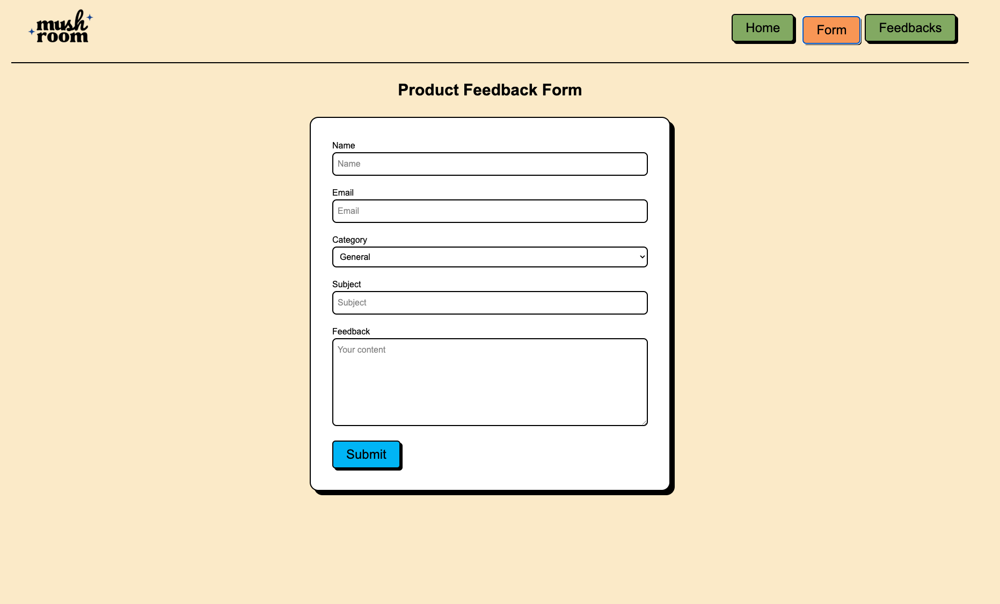
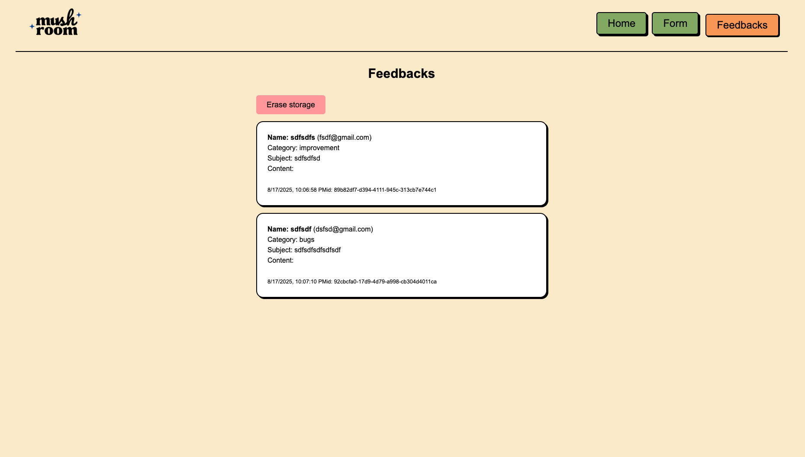

# Proposal for Unit Testing and Integration Testing in codebase (May Sunktong)

## Overview
This project is based on form validation and submission to local storage. User will submit a product feedback form and the data will be stored in local storage.

## Project Structure
💡 What knowledge you need to build this project: useState, useEffect, useContext, local storage
This project consists of 3 main pages:
1. Homepage - <Home/>
- h1, h2 headings
- a button to navigate to the form page
- a button to navigate to the feedback page
2. Form Page - <FormPage/>
- form with fields: name, email, category, subject, content
- submit button
- clearance of form after submission
- form validation (required fields)
3. Feedback page (local storage) - <FeedbackPage/>
- fetch data from local storage
- display data in a list
- a button to erase delete data in local storage

# Unit Testing
- Testing each component that appears to user's eyes
- Ensuring that the components render correctly
- Validating that the components behave as expected
- also what should not be rendered and what should not be in the components

# Integration Testing
- focus on form validation and submission
- rendering the form with complete data
- rendering only required fields
- reset form after submission
- require mocking functions to simulate user interactions

# __tests__ File structure
I have created testings only for important components and pages. You can follow and build along with the structure below:

- __tests__/pages/Home.test.tsx
- __tests__/pages/FormPage.test.tsx
- __tests__/pages/FeedbackPage.test.tsx

- __tests__/components/Navigation.test.tsx  ⬅️ in layout.tsx
- __tests__/components/FormBody.test.tsx  ⬅️ in FormPage.tsx
- __tests__/components/FeedbackList.test.tsx  ⬅️ in FeedbackPage.tsx

